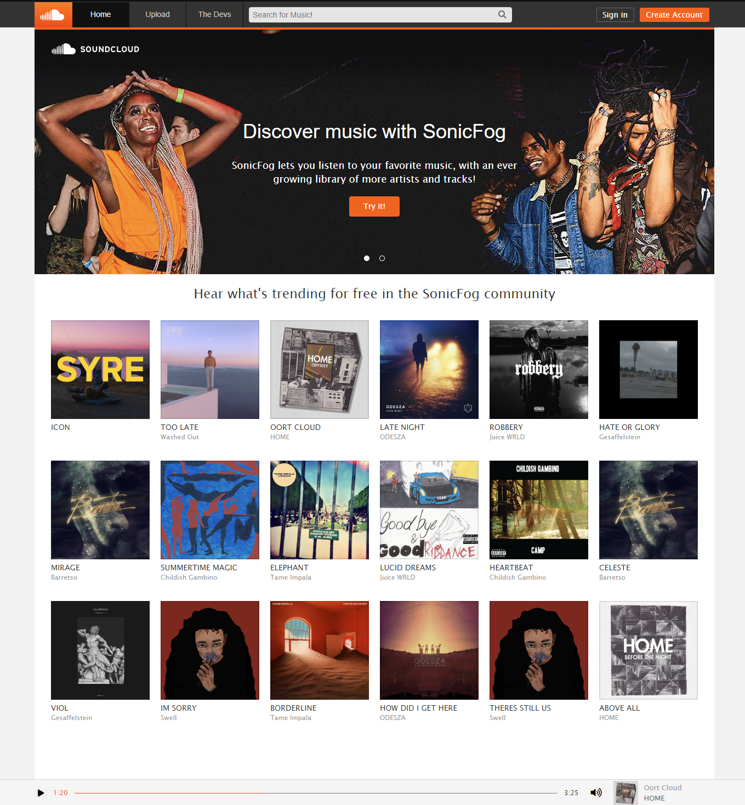

<!-- PROJECT LOGO -->
<br />
<p align="center">
  <a href="https://github.com/alex-pezzati/sonic-fog">
    
  </a>

  <h2 align="center" id="readme">Sonic Fog</h2>

  <p align="center">
    A Clone of SoundCloud
    <br />
    ·
    <a href="https://sonic-fog.herokuapp.com/">Live Link</a>
    ·
  </p>
</p>

## About The Project

Sonic Fog is a full stack application incorporating React and Redux on the frontend with Flask, SQLAlchemy and PostgreSQL on the backend. The app uses AWS S3 to store all song and photo data while serializing data to store in PostgreSQL. It also has a functioning wave form music player 🎧.



## Languages and Technologies

This is a concise list of what was utilized to develop this project.

- [Javascript](https://nodejs.org/en/)
- [Python](https://www.python.org/)
- [React](https://reactjs.org/docs/getting-started.html)
- [Redux](https://redux.js.org/)
- [Flask](https://flask.palletsprojects.com/en/2.1.x/)
- [SQLAlchemy](https://www.sqlalchemy.org/)
- [PostgreSQL](https://www.postgresql.org/)
- [Pydub](http://pydub.com/)
- [AWS S3](https://docs.aws.amazon.com/s3/index.html)

## Getting Started

To get a local copy up and running follow these simple steps.

1. Clone this repository (only this branch)

   ```bash
   git clone https://github.com/alex-pezzati/Sound_Cloud.git
   ```

2. Install dependencies

   ```bash
   pipenv install --dev -r dev-requirements.txt && pipenv install -r requirements.txt
   ```

3. Create a **.env** file based on the example with proper settings for your
   development environment
4. Setup your PostgreSQL user, password and database and make sure it matches your **.env** file

5. Get into your pipenv, migrate your database, seed your database, and run your flask app

   ```bash
   pipenv shell
   ```

   ```bash
   flask db upgrade
   ```

   ```bash
   flask seed all
   ```

   ```bash
   flask run
   ```

6. To run the React App in development, checkout the [README](./react-app/README.md) inside the `react-app` directory.

## Contact

Jamie Kichuk - [@LinkedIn](https://www.linkedin.com/in/jamie-kichuk-45778068/) - [@Website](https://www.raymondmay.com/) - jckichuk@gmail.com

Raymond-Arthur May - [@LinkedIn](https://www.linkedin.com/in/coderay/) - [@Website](https://www.raymondmay.com/) - raymond@raymondmay.com

Alex Pezzati - [@LinkedIn](https://www.linkedin.com/in/alex-pezzati/) - [@Website](https://github.com/alex-pezzati/) - aapezzati@gmail.com
